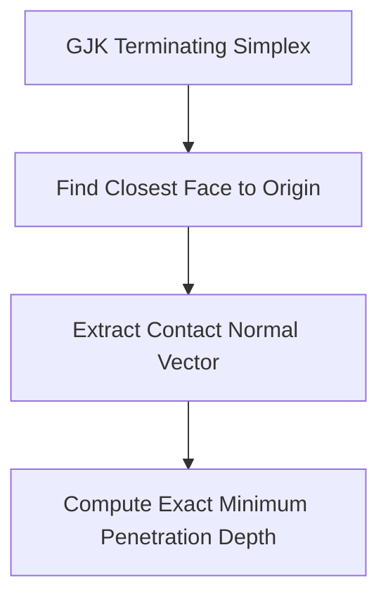

# EPA Penetration Depth Vector Skill

High-efficiency, zero-dependency Python implementation of the **Expanding Polytope Algorithm (EPA)** for exact collision response normals and penetration depth resolution.

## Features
- **Origin Distance Minimization**: Expands enclosing simplices outward to locate the closest boundary face to the origin.
- **Contact Normal Generation**: Computes unit normal vectors required for impulse restitution physics solvers.
- **Zero External Dependencies**: Pure Python standard library.
- **Native MCP Protocol**: JSON-RPC 2.0 stdio server compatible with Claude Desktop, Cursor, and Windsurf.

## Architecture

